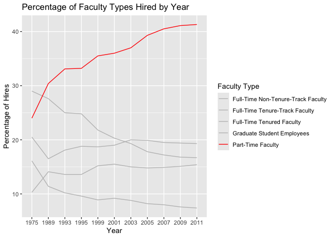
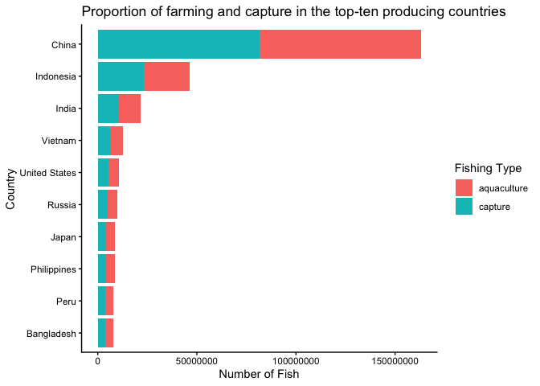
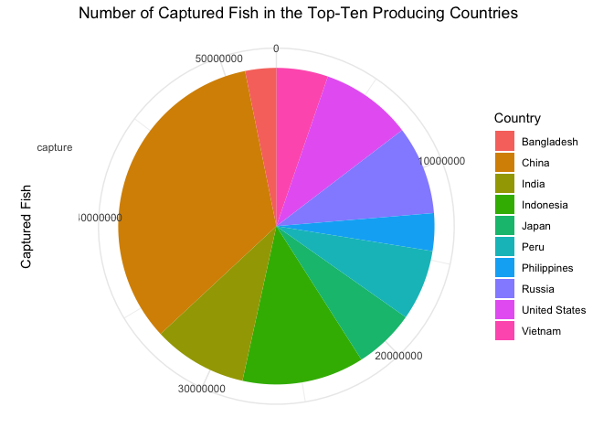
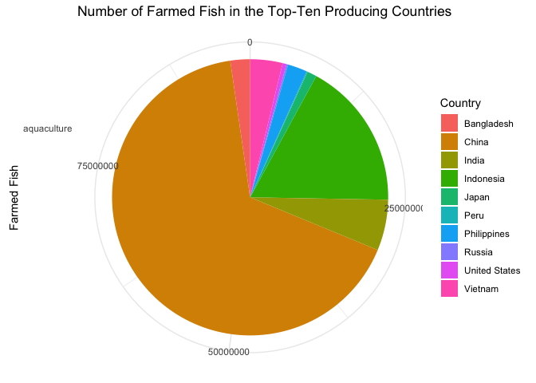
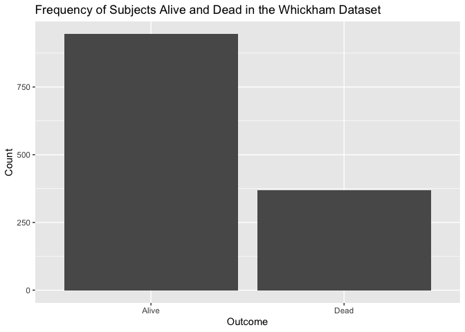
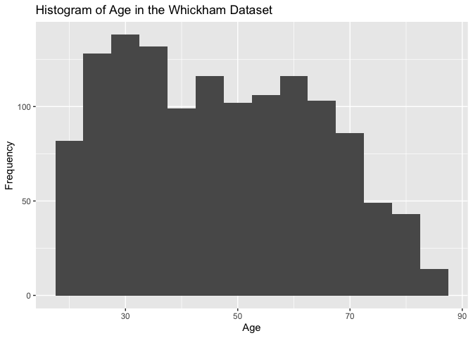
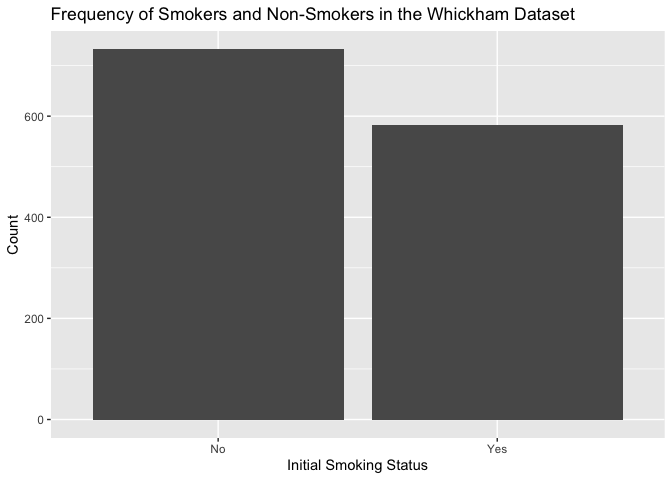
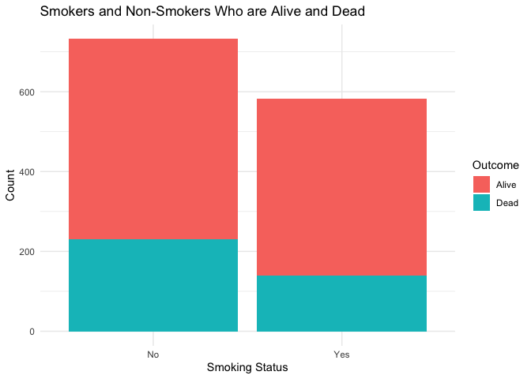
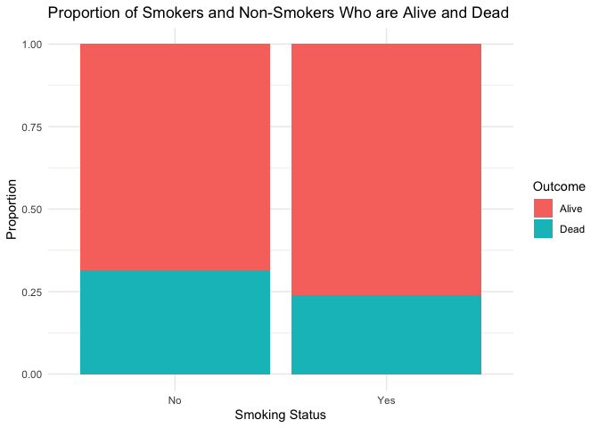

Lab 06 - Ugly charts and Simpson’s paradox
================
Cailey Fay
2/15/26

### Load packages and data

``` r
library(tidyverse) 
library(dsbox)
library(mosaicData) 
library(ggplot2)
staff <- read_csv("data/instructional-staff.csv")
fisheries <- read_csv("data/fisheries.csv")
```

I think when we convert to long-form data, we will have 6 columns. If
there are five different faculty types and 11 years, I think that means
we will have 5x11 = 55 rows?

To get the data long:

``` r
staff_long <- staff %>%
  pivot_longer(cols = -faculty_type, names_to = "year") %>%
  mutate(value = as.numeric(value))
staff_long
```

    ## # A tibble: 55 × 3
    ##    faculty_type              year  value
    ##    <chr>                     <chr> <dbl>
    ##  1 Full-Time Tenured Faculty 1975   29  
    ##  2 Full-Time Tenured Faculty 1989   27.6
    ##  3 Full-Time Tenured Faculty 1993   25  
    ##  4 Full-Time Tenured Faculty 1995   24.8
    ##  5 Full-Time Tenured Faculty 1999   21.8
    ##  6 Full-Time Tenured Faculty 2001   20.3
    ##  7 Full-Time Tenured Faculty 2003   19.3
    ##  8 Full-Time Tenured Faculty 2005   17.8
    ##  9 Full-Time Tenured Faculty 2007   17.2
    ## 10 Full-Time Tenured Faculty 2009   16.8
    ## # ℹ 45 more rows

This confirms my thought that there would be 55!

To try to plot this as a line graph with years on the x, the percentage
of hires on the y, and 5 lines for the diferent faculty types:

``` r
staff_long %>%
  ggplot(aes(x = year, y = value, color = faculty_type)) +
  geom_line()
```

    ## `geom_line()`: Each group consists of only one observation.
    ## ℹ Do you need to adjust the group aesthetic?

<!-- -->

This doesn’t quite work.

### Exercise 1

``` r
staff_long %>%
  ggplot(aes(
    x = year,
    y = value,
    group = faculty_type,
    color = faculty_type
  )) +
  geom_line() +
  labs(title = "Percentage of Faculty Types Hired by Year",
       x= "Year",
       y= "Percentage of Hires",
       color = "Faculty Type")
```

<!-- -->

### Exercise 2

Suppose the objective of this plot was to show that the proportion of
part-time faculty have gone up over time compared to other instructional
staff types. What changes would you propose making to this plot to tell
this story?

I would make all of the lines grey except the part time faculty. I think
this pretty clearly communicates that the percentage of part time
faculty hires is increasing.

``` r
staff_long %>%
  ggplot(aes(
    x = year,
    y = value,
    group = faculty_type,
    color = faculty_type
  )) +
  geom_line() +
  labs(title = "Percentage of Faculty Types Hired by Year",
       x= "Year",
       y= "Percentage of Hires",
       color = "Faculty Type") +
    scale_color_manual(values = c(
    "Full-Time Tenured Faculty" = "grey",
    "Full-Time Tenure-Track Faculty" = "grey",
    "Full-Time Non-Tenure-Track Faculty" = "gray",
    "Part-Time Faculty" = "red",
    "Graduate Student Employees" = "grey"
  )) 
```

<!-- -->

### Exercise 3

I think it depends on what the point of the visual is, which is sort of
unclear because of how ugly and unreadable the graphs are. A graph is
going to look very different if we are interested in comparing total
volume from country to country, versus if we are interested in the
proportion of fish are captured vs farmed for each country.

The line chart visual looks like it is taking the proportion versus
total approach, whereas the pie charts look like they are communicating
each country’s proportion of the total amount of captured fish and
farmed fish.

To do a better job showing the line chart, I would start by first making
it into bars and restricting it to the top-ten heavy hitters in the fish
department, in terms of total.This should help make the y scale more
reasonable and interpretable, even if we loose a little bit of
information about the countries. I also want to convert the data so that
we have a 2 rows per country where one is the capture and one is the
aquaculture. I am going to reapply the pivot strategy from earlier in
the lab.

``` r
options(scipen = 999) # sick of scientific notation

fisheries_long <- fisheries %>%
  pivot_longer(cols = c("capture","aquaculture"), names_to = "type") %>%
  mutate(value = as.numeric(value))
fisheries_long
```

    ## # A tibble: 432 × 4
    ##    country        total type        value
    ##    <chr>          <dbl> <chr>       <dbl>
    ##  1 Afghanistan     2200 capture      1000
    ##  2 Afghanistan     2200 aquaculture  1200
    ##  3 Albania         8836 capture      7886
    ##  4 Albania         8836 aquaculture   950
    ##  5 Algeria        96361 capture     95000
    ##  6 Algeria        96361 aquaculture  1361
    ##  7 American Samoa  3067 capture      3047
    ##  8 American Samoa  3067 aquaculture    20
    ##  9 Andorra            0 capture         0
    ## 10 Andorra            0 aquaculture     0
    ## # ℹ 422 more rows

``` r
top_ten_long <- fisheries_long %>%
  arrange(desc(total)) %>%
  filter(total >= 3878324) #the total of the 10th highest producer 
```

``` r
ggplot(top_ten_long, mapping = aes(x=fct_reorder(country, total, .desc = FALSE), y=total, fill=type)) +
  geom_col() +
  theme_classic()+
  labs(title = "Proportion of farming and capture in the top-ten producing countries",
       x= "Country",
       y = "Number of Fish",
       fill = "Fishing Type") +
  coord_flip()
```

<!-- -->

``` r
#this graph still isn't amazing but it is more readable 
```

Next I will take on those pie charts. I think the plan is to facet by
type. I will also switch it to polar coordinates to get it into the pie
chart look. The result also isn’t awesome but its something

``` r
top_ten_long %>%
  filter(type == "capture") %>%
ggplot(top_ten_long, mapping = aes(x=type, y=value, fill = country)) +
geom_col() + 
  coord_polar(theta = "y") + 
  theme_minimal() +
  labs(title = "Number of Captured Fish in the Top-Ten Producing Countries",
       x= "Captured Fish",
       y= element_blank(),
       fill = "Country") 
```

    ## Warning: `label` cannot be a <ggplot2::element_blank> object.

<!-- -->

``` r
#dodged_bar_plot + coord_polar()
#I don't know how to get rid of that random "capture" on the side there
```

And I can do the same thing for farmed fish. Faceting was too hard.

``` r
top_ten_long %>%
  filter(type == "aquaculture") %>%
ggplot(top_ten_long, mapping = aes(x=type, y=value, fill = country)) +
geom_col() + 
  coord_polar(theta = "y") + 
  theme_minimal() +
  labs(title = "Number of Farmed Fish in the Top-Ten Producing Countries",
       x= "Farmed Fish",
       y= element_blank(),
       fill = "Country") 
```

    ## Warning: `label` cannot be a <ggplot2::element_blank> object.

<!-- -->

``` r
#I don't know how to get rid of that random "aquaculture" on the side there
```

### Stretch Practice

Loading and inspecting the data:

``` r
data("Whickham")
?Whickham
library(performance)
```

    ## Warning: package 'performance' was built under R version 4.5.2

Exercises: 1. This does not seem like an experiment. It is a survey and
the variables are survival status, smoking status, and age, none of
which can be manipulated experimentally.

2.  There are 1314 observations. Each observation represents one woman.

3.  There are three variables: smoking status -factor with 2 levels-,
    outcome -factor with 2 levels-, and age -integer.

``` r
str(Whickham$outcome)
```

    ##  Factor w/ 2 levels "Alive","Dead": 1 1 2 1 1 1 1 2 1 1 ...

``` r
str(Whickham$age)
```

    ##  int [1:1314] 23 18 71 67 64 38 45 76 28 27 ...

``` r
str(Whickham$smoker)
```

    ##  Factor w/ 2 levels "No","Yes": 2 2 2 1 1 2 2 1 1 1 ...

``` r
#visuals 
ggplot(Whickham, mapping = aes(x=outcome)) + 
  geom_bar() +
  labs(title = "Frequency of Subjects Alive and Dead in the Whickham Dataset",
       x= "Outcome",
       y = "Count")
```

<!-- -->

``` r
ggplot(Whickham, mapping = aes(x=age)) + 
  geom_histogram(binwidth = 5) +
  labs(title= "Histogram of Age in the Whickham Dataset",
                          x="Age",
                          y= "Frequency")
```

<!-- -->

``` r
ggplot(Whickham, mapping = aes(x=smoker)) + 
  geom_bar() +
  labs(title = "Frequency of Smokers and Non-Smokers in the Whickham Dataset",
       x= "Initial Smoking Status",
       y = "Count")
```

<!-- -->

4.  I would expect people who were smokers to be more likely to have the
    outcome status “Dead”.

Here are the counts:

``` r
Whickham %>%
  count(smoker, outcome)
```

    ##   smoker outcome   n
    ## 1     No   Alive 502
    ## 2     No    Dead 230
    ## 3    Yes   Alive 443
    ## 4    Yes    Dead 139

5.  This visual suggests the opposite of what I expected, however it is
    not corrected for the total number of non-smokers versus smokers. My
    chart shows that if you look at numbers of peopple - and not
    proportions - more non-smokers have died versus smokers.

``` r
ggplot(Whickham, mapping = aes(x= smoker, fill=outcome)) +
  geom_bar(stat = "count") +
  theme_minimal() +
  labs(title = "Smokers and Non-Smokers Who are Alive and Dead",
       x = "Smoking Status",
       y = "Count",
       fill = "Outcome")
```

<!-- -->

I am going to make this slightly different, so it is adjusting for how
many people are smokers versus not smokers. This graph still suggests
that more people who are dead that were non-smokers, which is whacky.

``` r
ggplot(Whickham, mapping = aes(x= smoker, fill=outcome)) +
  geom_bar(position = "fill") +
  theme_minimal() +
  labs(title = "Proportion of Smokers and Non-Smokers Who are Alive and Dead",
       x = "Smoking Status",
       y = "Proportion",
       fill = "Outcome")
```

<!-- -->

6.  Create a new variable called age_cat using the following scheme: age
    \<= 44 ~ “18-44” age \> 44 & age \<= 64 ~ “45-64” age \> 64 ~ “65+”

``` r
Whickham <- Whickham %>%
  mutate(age_cat = case_when(
    age <= 44 ~ "18-44",
    age > 44 & age <= 64 ~ "45-64",
    age > 64 ~ "65+"
  ))
```

7.  When faceted by age category, the picture makes more sense: in each
    age category, there are a greater proportion of dead smokers than
    dead non-smokers, and overall the proportion of dead people
    increases as you move up the age brackets. This is more consistent
    with the idea that smoking is related to a greater probability of
    death.

``` r
Whickham %>%
  count(smoker, age_cat, outcome)
```

    ##    smoker age_cat outcome   n
    ## 1      No   18-44   Alive 327
    ## 2      No   18-44    Dead  12
    ## 3      No   45-64   Alive 147
    ## 4      No   45-64    Dead  53
    ## 5      No     65+   Alive  28
    ## 6      No     65+    Dead 165
    ## 7     Yes   18-44   Alive 270
    ## 8     Yes   18-44    Dead  15
    ## 9     Yes   45-64   Alive 167
    ## 10    Yes   45-64    Dead  80
    ## 11    Yes     65+   Alive   6
    ## 12    Yes     65+    Dead  44

``` r
ggplot(Whickham, mapping = aes(x= smoker, fill=outcome)) +
  geom_bar(position = "fill") +
  facet_wrap(~age_cat) +
  theme_minimal() +
  labs(title = "Proportion of Smokers and Non-Smokers Who are Alive and Dead",
       subtitle = "By Age Category",
       x = "Smoking Status",
       y = "Proportion",
       fill = "Outcome")
```

<!-- -->
